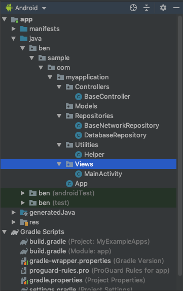
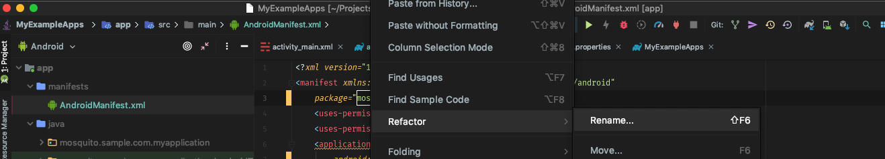
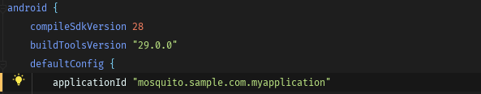

# Sample Android Project SetUp
Simple Starting Points for Android Projects with different branch holding different starts that are not currently int he setup wizard for android studio.

With the objective to have you up and runnign with the basics.

Just clone and renaming the android app name and the package name
 
## Current set ups: 
### Branchs

#### Master
Just has default packages set up and base controller and gradle set up.

#### Android Architecture Components
Make use of Android Architecture Components, View cotnrollers and live data in the controllers for a RX feel 
https://developer.android.com/topic/libraries/architecture

#### Bottom Bar Navigation
Make use of the of the bottom nav bar. 

https://material.io/develop/android/components/bottom-navigation-view/

#### Exmaple:

#### Refactoring for your use:
For your own use you will have to change the packages ids to your own projects packages names.

There are many ways to do this the easiest way to do is to go into the Android manifiest in the manifest folder.

on the package="mosquito.sample.com.myapplication" tag, hover over the section you want to change , right click and press refactor , press ok to the warning and change it to what value you want.

Then Make sure to change the ApplicastionId in the gradle file to match the new package name you have set up , as shown below

## TODO: 
Add more basic set ups for other design patterns the Build in Android wizard dosnt support
